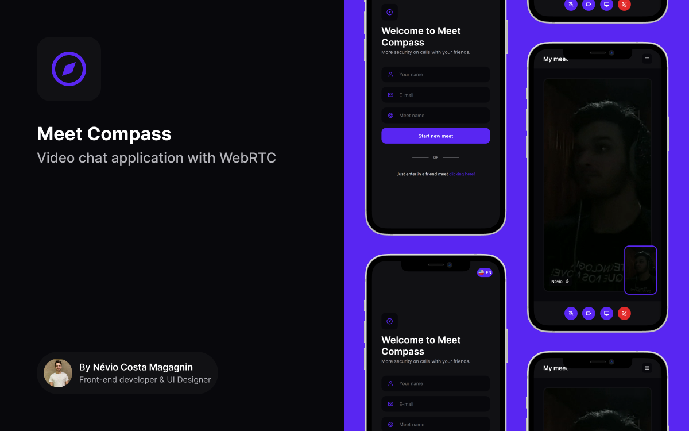

<div id="top"></div>

<br />

<div align="center">
  <a href="https://user-images.githubusercontent.com/45011343/174501665-8be30f33-7850-4c97-90ac-633debe2dedc.png">
    
  </a>

  <h3 align="center">
	Meet Compass
  </h3>

  <p align="center">
    An awesome meet app built with Next.js
    <br />
    <a href="https://meet-compass.herokuapp.com/"><strong>Visit the site »</strong></a>
  </p>
</div>

## :computer: About the project

Meet Compass is a project created by me - [Névio Costa Magagnin](https://www.linkedin.com/in/n%C3%A9vio-magagnin-045710177/) - using WebRTC to connect both users in a video meet. It was build using Next.Js with styled-components and socket connections to handle events during the meet.

The project is a simple video chat application that can only connect two users in a meet.

Features:
- Create meet
- Join meet
- Video chat
- Message chat
- Share screen
- Rename meet
- Send user e-mail
- Remove user from meet
- Select language



## :electric_plug: How it works

You just need to open the site to be able to create a meet or connect to other user meet. This happens because when the sites starts it is opened a web socket connection.

In the home page, you have two choises, **create a meet** or **joing an existing meet**. By creating a new meet you are going to be redirect to the meet page and there you can copy your meet link and share with someone.

Now, to join an existing meet you need to click in **join meet** link right after the **create new meet** button in the home page. When clicked, it is going to open a modal in the middle of the screen. You just need to put your name, e-mail and meet ID that you received and then click **Join meet**.

This are going to happen automatically when the user open a shared meet link.

This projects uses **WebRTC** and the **[simple-peer](https://github.com/feross/simple-peer)** package to create a connection between the users to share the video and audio. 

Web socket is a plus in this project. It helps to handle the peer connections and a lot of events like send a message to other user.

## :hammer_and_wrench: How to run

- First, clone the repository
```
  ~ git clone https://github.com/NEVI0/meet-compass.git
```

- Then open the project and install the dependencies
```
  ~ yarn
```

- Now, you just need to run
```
  ~ yarn dev
```

## :iphone: Contact

- **[LinkedIn](https://www.linkedin.com/in/n%C3%A9vio-magagnin-045710177/)**
- **[Instagram](https://www.instagram.com/nevio_costa/)**
- **neviocostamagagnin@gmail.com**

<p align="right">
  <a href="#top">:arrow_up:</a>
</p>
